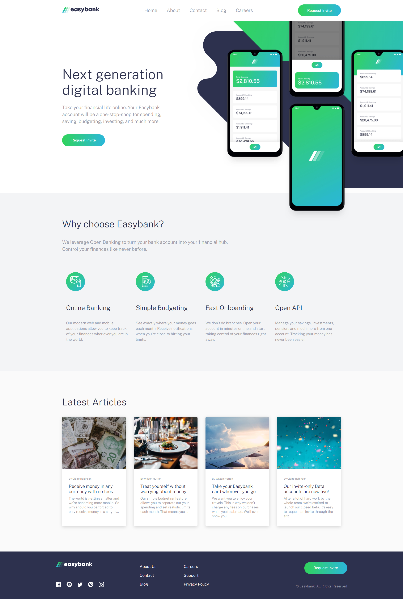

# Frontend Mentor - Easybank landing page

## Welcome! 👋

This is a landing page done with the given desing by www.frontendmentor.io. I used 'mobile first' to get done my page. That means that I first developed the mobile view of this landing page and after that, the desktop.  The technologies I used to get this done are the following:

- Html5
- Sass (Mixins, includes, variables...)
- Javascript

I also used BEM which is a naming convention for classes.

## Screenshot

